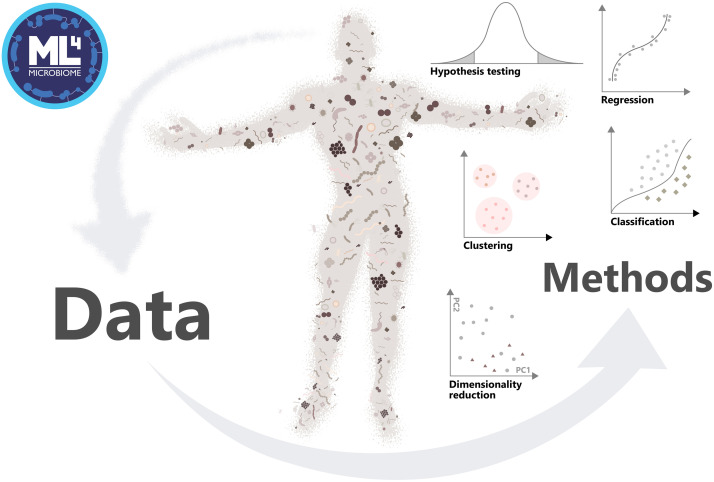

--- 
title: "Multi-omic data science with R/Bioconductor"
subtitle: "Oulu Summer School, June 2023"
date: "2023-06-06"
site: bookdown::bookdown_site
documentclass: book
bibliography: [packages.bib]
biblio-style: apalike
link-citations: yes
github-repo: microbiome/course_2023_oulu
description: "Course material"
output:
  bookdown::gitbook
  bookdown::pdf_document2
always_allow_html: true  
classoption: oneside
geometry:
  - top=30mm
  - left=15mm
---

# Overview

<!---->

## Contents and learning goals

::: {.grid}

::: {.g-col-8}
**Contents and learning goals**: This course provides an introduction to multi-omic data integration and analysis with R/Bioconductor, a popular open source environment for scientific data analysis. After the course you will know how to organize multiple data sources into a coherent framework, implement reproducible data science workflows, and approach common data analysis tasks by utilizing available documentation and R tools. The primary focus is on microbiome research but the covered data science methods are generally applicable and we will discuss links with other application domains such as transcriptomics, metabolomics, and single cell sequencing. 

**Target audience**: MSc students, PhD, postdoctoral, and other researchers who wish to learn new skills in statistical programming and data analysis. Academic students and researchers from Finland and abroad are welcome and encouraged to apply.

**Teaching material**: We will follow open online documentation created by the course teachers, primarily the [Orchestrating Microbiome Analysis](https://microbiome.github.io/OMA)
(OMA) book. The training material walks you through the standard steps of omics data analysis covering data access, exploration, analysis, visualization, and reproducible workflows. Preparatory material and video clips, and online support are available before the course. All teaching material will be shared openly.
:::

::: {.g-col-3}
{fig-align="center" width="300"}
:::

:::

## Schedule 

The course is organized in a live format. Preparatory material and video clips, and online support are available before the course. All teaching material will be shared openly.

**Venue**: University of Oulu. June 19-21, 2023 (Mon-Wed). The course is organized in a live format. 

**Costs**: There is no registration fee for the course. Participants are expected to cover
  their own travel and accommodation.

**Accommodation**: Housing tips can be found at <https://visitoulu.fi/en/arrival-overnight/>.

**Schedule**: Contact teaching daily between 9am -- 4pm, including lectures, demonstrations, hands-on sessions, and breaks. 

 * Day 1 Reproducible workflows with R/Bioconductor and Quarto 
 * Day 2 Tabular data analysis (working with single 'omics) 
 * Day 3 Multi-assay data integration (multi-omics methods)

For a detailed schedule, see Section \@ref(program). The course can be
extended by an independent assignment (details will be agreed with the
main teacher).

## How to apply

- Send a brief motivation letter to Anna Kaisanlahti [anna.kaisanlahti\@oulu.fi](mailto:anna.kaisanlahti@oulu.fi){.email}
- Applications from local students, and applications sent before May 15 will be given priority
- The course has maximum capacity of 20 participants.

## Teachers and organizers

**Teachers**: [Leo Lahti](https://datascience.utu.fi) is the main teacher and Associate Professor in Data Science at the University of Turku. Dr. Pande Erawijantari is a co-teacher. Course assistants are *Tuomas Borman* (Turku), *Giulio Benedetti* (Turku), and *Anna Kaisanlahti* (Oulu). Docent *Justus Reunanen* is the course coordinator. The course is organized by [Health and Biosciences Doctoral Programme (HBS-DP)](https://www.oulu.fi/en/research/graduate-school/organisation-and-contact-information-uniogs/health-and-biosciences-doctoral-programme) University of Oulu Graduate School, Research Unit of Translational Medicine, University of Oulu. The [Finnish IT Center for Science (CSC)](https://csc.fi/) supports the course by providing cloud computing services.

## Code of Conduct

The Bioconductor community values an open approach to science that promotes the

 - sharing of ideas, code, software and expertise
 - collaboration
 - diversity and inclusivity
 - a kind and welcoming environment
 - community contributions
 
More details on its enforcement are available [here](https://bioconductor.github.io/bioc_coc_multilingual/).

## Acknowledgments

**Citation**: We thank all [developers and contributors](https://microbiome.github.io) who have contributed open resources that supported the development of the training material. Kindly cite the course material as @miacourse.

**Contact**: Refer to [https://microbiome.github.io](https://microbiome.github.io).

**License and source code**:

All material is released under the open [CC BY-NC-SA 3.0 License](LICENSE) and available online during and after the course, following the [recommendations on open teaching materials](https://avointiede.fi/fi/linjaukset-ja-aineistot/kotimaiset-linjaukset/oppimisen-ja-oppimateriaalien-avoimuuden-linjaus) of the national open science coordination in Finland.

The source code of this repository is reproducible and contains
the Rmd files with executable code. All files can be rendered at one
go by running the file [main.R](main.R). You can check the file for
details on how to clone the repository and convert it into a gitbook,
although this is not necessary for the training.

- Source code (github): [miaverse teaching material](https://github.com/microbiome/course_2023_oulu)
- Course page (html): [miaverse teaching material](https://microbiome.github.io/course_2023_oulu/)

